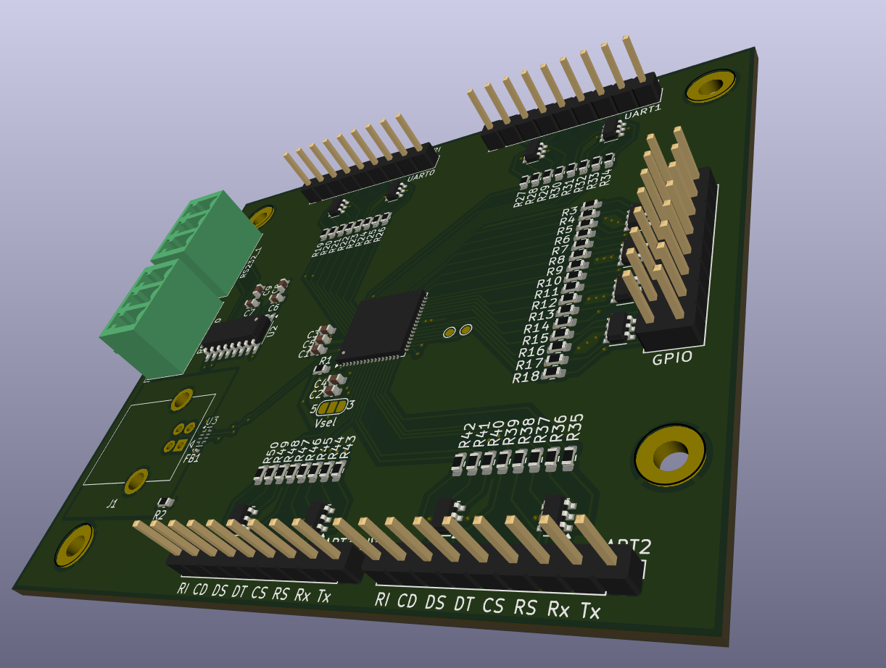
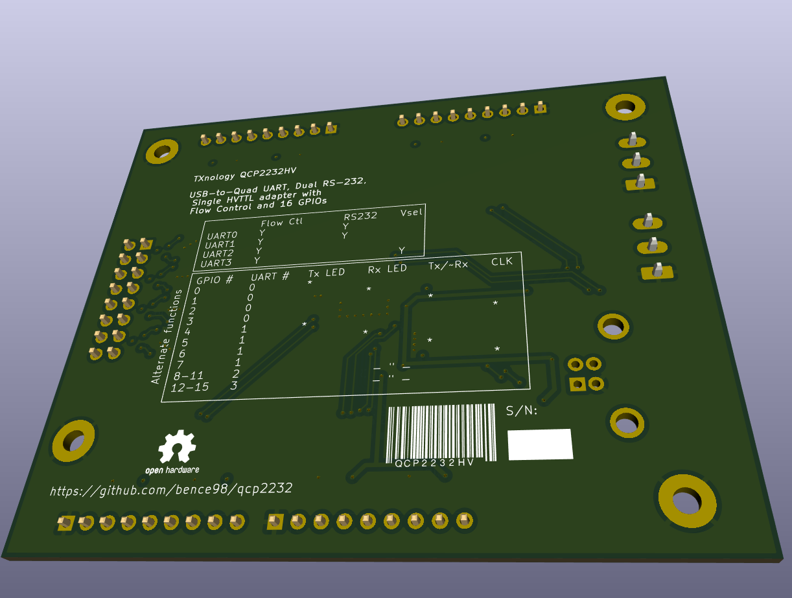

# QCP2232HV USB-to-Quad UART

## Features

4 TTL UARTs with full Flow Control
* Tx, Rx full duplex
* RTS/CTS (Request-/Clear-to-Send), DTR/DSR (Data Terminal/Set Ready)
* DCD (Data Carrier Detect), RI (Ring Indicator) inputs
* all pins ESD protected
  * full TVS diode protection
  * overcurrent limiting resistors
* see pinout at the end of the section

UART0 and UART1 have RS-232 option
* only Tx/Rx
* separate industrial connector
  * Phoenix MCV 1,5 G-3.81
  * Würth WR-TBL 321

UART3 has selectable TTL voltage (`Vsel`)
* 5V from USB or 3.3V from internal regulator
* UART0-2 are 3.3V

USB Type-B connector
* superior mechanical stability compared to Micro-B
* easier to handle than Mini-B
* more economical to produce than Type-C
* added noise immunity thanks to EMI suppression circuitry
* supports USB suspend mode

16 GPIOs
* 3.3V digital I/O
* all pins ESD protected
  * full TVS diode protection
  * overcurrent limiting resistors
* alternate functions, see table below
  * Tx, Rx LED: blinks on data transfer
  * Tx mode: for half duplex bus drivers eg. RS-485
  * clock: USART bit clock
* configurable via Silicon Labs' toolchain

| GPIO # | UART # | function |
|--------|--------|----------|
|      0 |      0 |   Tx LED |
|      1 |      0 |   Rx LED |
|      2 |      0 |  Tx mode |
|      3 |      0 |    clock |
|      4 |      1 |   Tx LED |
|      5 |      1 |   Rx LED |
|      6 |      1 |  Tx mode |
|      7 |      1 |    clock |
|      8 |      2 |   Tx LED |
|      9 |      2 |   Rx LED |
|     10 |      2 |  Tx mode |
|     11 |      2 |    clock |
|     12 |      3 |   Tx LED |
|     13 |      3 |   Rx LED |
|     14 |      3 |  Tx mode |
|     15 |      3 |    clock |

Pinout (UARTs):

|                | GND | TX  | RX | RTS | CTS | DTR | DSR | DCD | RI |
|----------------|-----|-----|----|-----|-----|-----|-----|-----|----|
| Label on board |     | Tx  | Rx | RS  | CS  | DT  | DS  | CD  | RI |
| Direction      | N/A | Out | In | Out | In  | Out | In  | In  | In |
